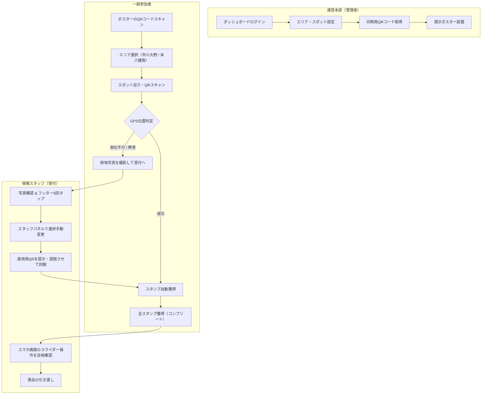
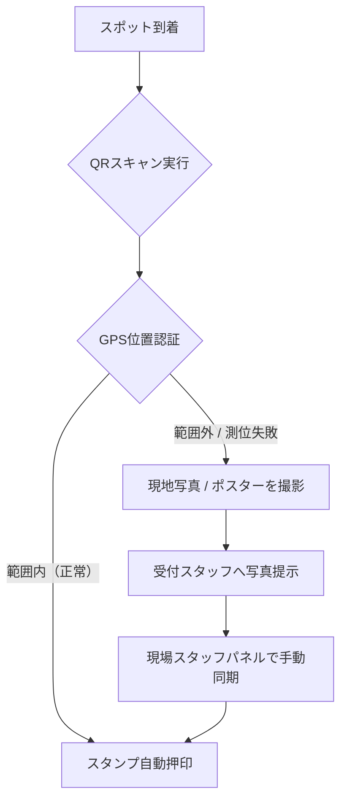
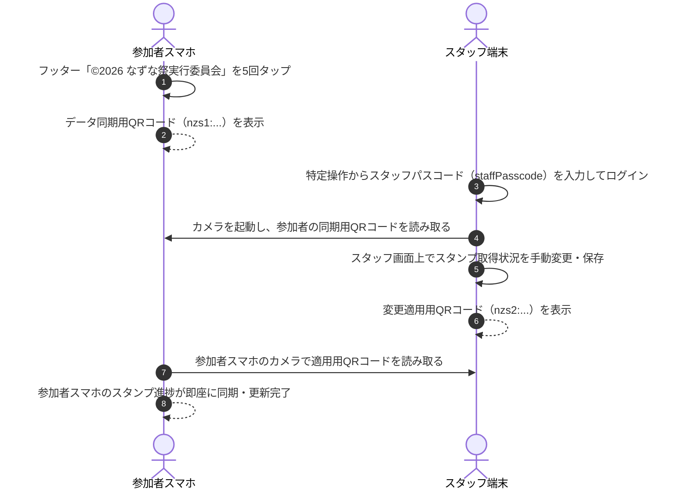
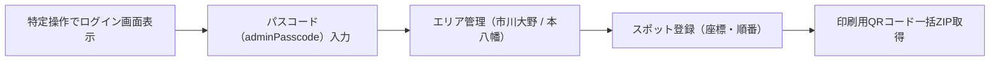

# なずな祭街歩きスタンプラリー 運用マニュアル

## 1. システム概要と基本仕様

___

本システムはなずな祭において、来場客がスマートフォンを利用して各エリアのスポット（チェックポイント）を巡り、スタンプを集めて景品を獲得するためのスタンプラリーアプリケーションである。

### 1.1 主な機能・特徴
- **Webブラウザ完結型**: 専用アプリのインストールを不要とし、標準ブラウザ（Safari / Chrome）で動作する。
- **QRコードスキャン機能**: 会場やスポットに掲示されたQRコードをカメラで読み取ることでスタンプを獲得する。
- **GPS位置情報連携**: チェックポイント付近にいることを測位確認してスタンプ獲得を認証する。
- **スタッフ用パスコード認証・データ同期（救済機能）**: 電波障害やGPS精度不良、端末トラブル発生時、スタッフ用パスコードおよび「現場スタッフパネル」による手動付与・同期QRコード読み取りにより進捗を補完可能とする。
- **アプリ内ブラウザ防止ガード**: LINEやInstagramなどの組み込みブラウザからのアクセスを検知し、標準ブラウザへの移動を自動誘導する。
- **現場スタッフ専用画面**: 参加者の進捗確認、スタンプ手動付与、景品引き換え確定処理を行う機能を提供する。(呼び出すのに特定の操作が必要)
- **管理者ダッシュボード**: スポット・エリアの登録編集、印刷用QRコードの一括生成・ZIPダウンロード、各種設定変更を行う。(呼び出すのに特定の操作が必要)

### 1.2 動作推奨環境
- **iOS**: Safari（iOS 14以上推奨）
- **Android**: Chrome（最新版推奨）
- **通信環境**: 4G/5G mobile network または Wi-Fi環境

### 1.3 全体運用イメージフロー

---

## 2. 一般参加者（ユーザー）操作手順

___

### 2.1 アクセスとブラウザガードの対応
1. 配布チラシやポスターのQRコードから本システムへアクセスする。
2. LINEやInstagram等のアプリ内ブラウザで開いた場合、「アプリ内ブラウザガード」画面が表示される。
3. 画面上の指示に従い、右上のメニューまたは専用ボタンから「Safariで開く」または「Chromeで開く」を選択し、外部ブラウザへ遷移する。

### 2.2 エリア選択とスタンプカード確認
1. トップ画面表示時、または画面上の「エリア選択」ボタンをタップすると、エリア切り替えモーダルが表示される。
2. 参加したいエリア（「市川大野」「本八幡」等）を選択する。
3. 選択したエリアに応じたスタンプ枠（スロット）がスタンプカード上に表示される。各枠にはスポット名称が明記される。

### 2.3 スポットマップの閲覧
1. 画面上の「マップを見る」ボタンをタップすると、マップモーダルが起動する。
2. 登録されている全チェックポイントの位置がピンで表示される。
3. ピンをタップすることで、スポットの名称、住所、説明、現在地からの距離を確認できる。

### 2.4 スタンプの獲得手順

#### A. QRコードスキャンによる標準獲得
1. 画面中央の「QRコードを読み取る」ボタンをタップし、カメラを起動する。
2. スポットに掲示されている専用QRコードをカメラの枠内に収める。
3. 位置情報（GPS）チェックが有効な場合、スポットの許容範囲内にいることが確認され次第スタンプが自動押印される。

#### B. GPS精度不良・端末トラブル時の獲得（写真撮影・スタッフ代理付与）
1. 屋内や地下、通信環境不良等によりGPS測位が完了しない場合、またはQRコードが正しく読み込めない場合は、該当スポットの現地写真や掲示ポスターを撮影しておく。
2. 景品交換所・案内所にて撮影した写真をスタッフに提示する。
3. スタッフが「現場スタッフパネル」を起動し、参加者端末とのデータ同期QRコードを相互読み取りすることで、該当スポットのスタンプを手動で獲得（補完・同期）する。

### 2.5 コンプリート特典の受取手順
1. 選択エリア内の全スタンプを集めると、画面上にコンプリートエフェクトおよび景品引き換えボタンが表示される。
2. 引き換えボタンをタップすると、「景品引き換え準備画面」が起動する。
3. 景品交換所にて現場スタッフにこの画面を提示する。

---

## 3. 現場スタッフ（景品交換・サポート）運用手順

___

景品交換所および各案内所に配置されたスタッフは、参加者の端末操作補助、不具合発生時のデータ補完、および景品引き換え処理を担当する。

### 3.1 景品引き換え対応フロー
1. 参加者のスマホ画面で、目の前でスライダーを動かさせ、コンプリートしたことを目視確認する。
2. スタッフが景品を渡す。

### 3.2 現場スタッフパネル（代理編集・進捗同期）によるデータ補完
参加者のGPS精度不良、端末不具合、ブラウザデータ消去等のトラブルが発生した場合、スタッフ端末から進捗を手動編集・同期復元する。(各スポット写真が必要な場合あり)

#### スタッフパネルの起動手順
1. 参加者またはスタッフのスマホ画面の最下部フッター（`©2026 なずな祭実行委員会`）を**5回連続でタップ**する。
2. 参加者側画面にデータ同期用QRコード（`nzs1:...`）が表示される。
3. スタッフ端末で本システムの「現場スタッフパネル」を特定の操作によりパスコード入力画面を開き、スタッフパスコード（`staffPasscode`）を入力してログイン後、「カメラ起動」をタップして参加者のQRコードを読み取る。

#### 進捗編集とデータ書き戻し手順
1. 読み取り完了後、スタッフ画面上に対象ユーザーのスタンプ取得状況一覧が表示される。
2. 該当スポットのボタンをタップして取得/未取得を切り替える（必要に応じて景品交換状態も変更可能）。
3. 「変更を保存して適用QRを表示」ボタンをタップする。
4. スタッフ端末上に変更適用用QRコード（`nzs2:...`）が表示される。これを**参加者のスマホカメラで読み取らせる**ことで、参加者側の進捗が即座に更新・反映される。

---

## 4. システム管理者（運営本部）操作・運用手順

___

運営本部は、「管理者ダッシュボード（Admin Dashboard）」にアクセスし、システム全般の管理を行う。

### 4.1 管理画面へのアクセス
1. 特定の操作によりパスコード入力画面を呼び出す。
2. 管理者パスコード（`adminPasscode`）を入力してログインを完了する。

### 4.2 エリア（セクション）の管理
1. ダッシュボードの「エリア管理」タブを開く。
2. 新規エリア名（例: `市川大野`, `本八幡`）と説明を入力し、「追加」ボタンを押下する。
3. 既存エリアの名称編集、説明更新、およびエリア削除（配下のチェックポイントも一括削除）が可能である。

### 4.3 チェックポイント（スポット）の登録・編集
1. 対象のエリアカード内にある「スポットを追加」ボタンを押下する。
2. 以下の項目を入力して保存する:
   - **スポット名称**: 掲示物やマップに表示する名前
   - **説明文**: スポットの補足説明・営業時間等
   - **緯度 (Latitude) / 経度 (Longitude)**: スポットの地理的座標
   - **順番 (Order)**: スタンプカード上の配置順序（1からの連番）
   - **カスタムQR ID (任意)**: 自動生成UUID以外の固定識別子を指定する場合に設定
3. 既存スポットの編集アイコンを押下することで、座標変更や名称修正を即座に反映できる。

### 4.4 掲示用QRコードの生成・ダウンロード
印刷物・掲示ポスター用のQRコード画像を生成・保存する機能である。

#### A. 単体QRコードのPNGダウンロード
- スポット一覧の各スポットカードにある「QRダウンロード」ボタンを押下する。
- スポット名・エリア名・専用枠が自動合成されたPNG画像（1000x1120 px）がダウンロードされる。

#### B. 一括ZIPダウンロード
- エリア全体の「一括ZIPダウンロード」ボタン、または全体の「全エリアQR一括ZIP取得」ボタンを押下する。
- 全チェックポイントの印刷用PNG画像がエリアごとにフォルダ分けされた状態の `.zip` アーカイブとして一括生成・ダウンロードされる。

### 4.5 システム全体設定（Security & Maintenance）
「システム設定」タブより以下の項目を変更・管理する。
- **システム緊急停止フラグ**: イベント終了後や緊急時にシステム全体をメンテナンス表示に切り替える。
- **スタッフ用パスコードの変更**: 現場スタッフの引き換え・認証用パスコードを任意の値に更新する。
- **管理者パスコードの変更**: ダッシュボードログイン用の管理者パスコードを変更する。

---

 

## 5. トラブルシューティングおよび緊急時対応

___

### 5.1 カメラが起動しない / QRコードがスキャンできない場合
- **原因1: ブラウザのカメラ利用許可が拒否されている**
  - 対処: スマホの「設定」>「プライバシーとセキュリティ」>「カメラ」から、使用中のブラウザ（Safari/Chrome）へのカメラ権限を「許可」に変更させる。
- **原因2: 暗所や反射による読み取り不可**
  - 対処: スタッフが「3.2 現場スタッフパネル」を用いて手動付与・同期QRコードでのデータ更新を実施する。

### 5.2 位置情報（GPS）が取得できない / 誤差が大きい場合
- **原因: 屋内・地下・高層ビル群による電波遮断**
  - 対処: 対象スポットの現地写真または掲示ポスターを撮影して受付へ持参させる。現場スタッフが「3.2 現場スタッフパネル」を起動し、対象スポットのスタンプを手動でONにして同期用QRコードを読み取らせることで位置判定をスキップし補完する。

### 5.3 参加者のスタンプデータが消失した場合
- **原因: ブラウザのプライベートモード利用、またはキャッシュ・Cookieの消去**
  - 対処: 「3.2 現場スタッフパネル」の手順に従い、スタッフ端末から参加者の取得状況を代理設定し、同期用QRコードを読み取らせてデータを即座に復元する。

---

| 役割 | 主な担当作業 | 緊急時連絡 |
| :--- | :--- | :--- |
| **一般参加者** | QRスキャン / マップ閲覧 / 景品画面提示 | 案内所スタッフへ相談 |
| **現場スタッフ** | 景品交換確認（スライダー目視確認） / パスコード認証 / 代理データ復元・補完 | 本部管理者へ報告 |
| **運営本部** | スポット管理 / QRコード印刷 / システム設定変更 | 開発者へ連絡 |

